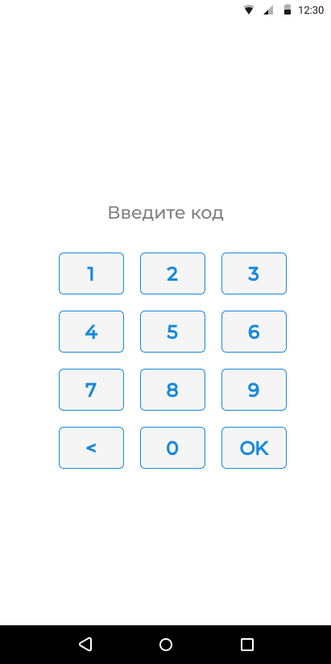
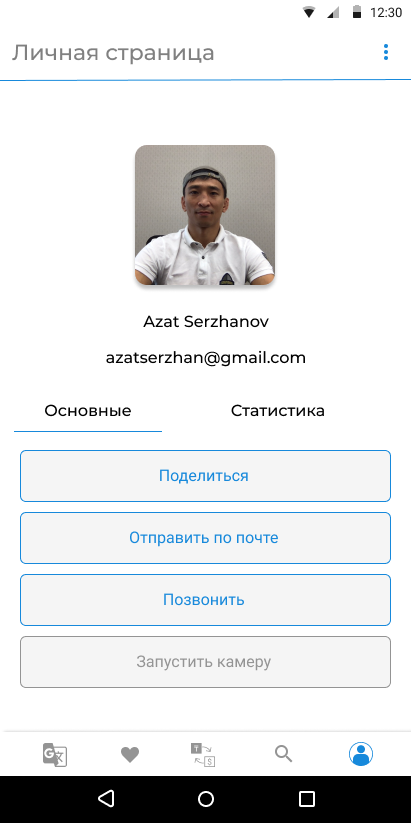
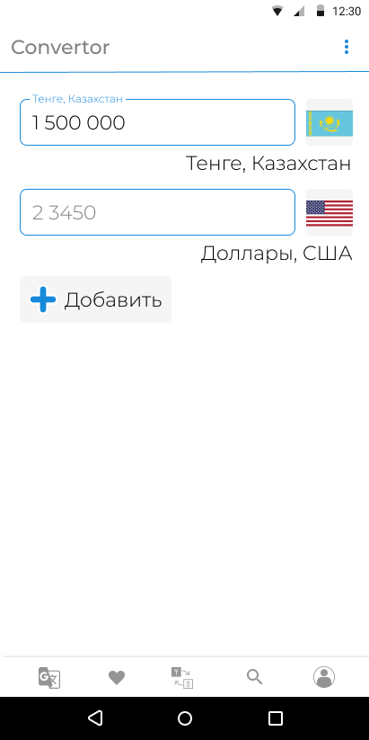
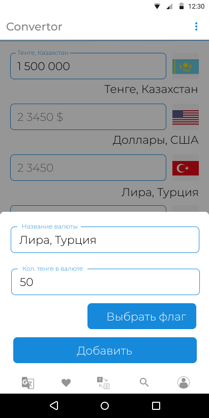

# Singularity Super App

A multi-functional app that uses different development tools and libraries. Written in purpose of practise of learnt topics. 

## Main Functionalities

- Movie search
- Currency Converter

## Stack
- **Language:** Kotlin

- **Libraries:** Retrofit, okhttp, Android Jetpack Components, Koin (for DI) 

- **Architecture Pattern:** MVVM 

## Screenshots
Verification | Profile | Movie Search | Converter | Add Currency
--- | --- | --- | --- | --- 
 |  |  |  |  

